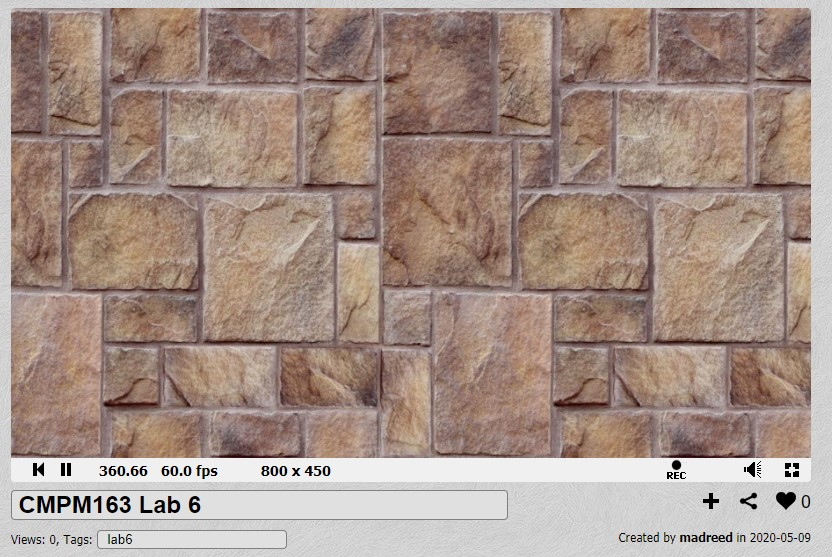
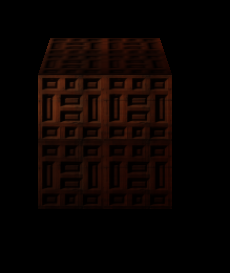
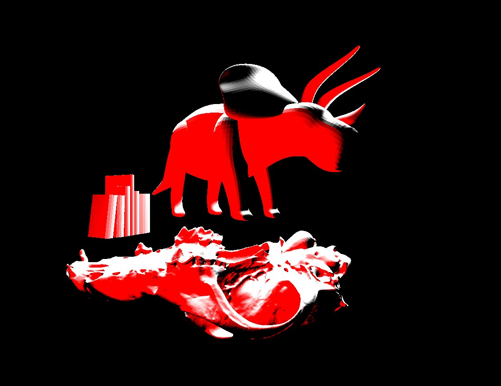

# CMPM163Labs
all the labs

Lab6:

https://www.shadertoy.com/view/WslfWB
https://www.shadertoy.com/view/lsGGDd
I found this cool since it taught me how to complete the assignment.

Lab5:
video: https://drive.google.com/file/d/1deLUUZj4ZVF2ag166dst0MM1xbMaAkwI/view?usp=sharing
I changed up the sky art by going to the specific pieces the skybox used and changing the tint as well as the saturation.
I then dragged a bunch of skybox parts onto the track, ground, and checkpoint rings in order to change their matirial to something funky looking.
And more importantly I changed the in-game audio track to some music I recorded and mixed rather than what was already there. To do this I just needed to drop my audio into the audio folder and set the background music to my track.

Lab4:
a. x = Math.round(Math.abs((u)/0.14)) //0.14 is a consise value that will work for our 8x8, but I would change it for a larger array

b. y = Math.round(Math.abs((v-1)/0.14)) //because the origin is different on both arrays I need to flip it around with that -1

c. (3 , 5) Blue

Cubes: https://drive.google.com/file/d/1P8anrCROP3CBbekkhUaNfIn8d5m4Bybw/view?usp=sharing

Cube 1: This is the center cube. The way this worked was to just slap a texture and a normal onto a cube THREE did all the hard stuff.

Cube 2: This was the left cube, meant to serve as a contrast to the middle. This cube has a texture but no normal, so no fun shadows.

Cube 3: This was the right cube, just another example of a texture paired with a normal.

Cube 4: This was the top cube. This was made with a frag/vertex shader that slaps a texture on a cube.

Cube 5: God this last cube, the bottom cube. This was hell. essentially it was the same as cube 4, a cube made with a frag/vert shader. But we had to tile this, so the way I origionally tried this was to fine where each tile should go and multiply them together, but of course that didn't work because each successive cube got darker, as seen below. What I eventually found out, was that you could move each tile individually and place them at seperate times with if statements.

vvv THIS IS AN EXAMPLE OF AN ISSUE I CAME ACROSS

Lab3:
https://drive.google.com/open?id=1Vu_jSCz34-MgD23y3UmJxEmyiquhEMAh

-left: This cube was made with the provided interpolation shader I like green so I kept that as one of the colors and added red to the other uniform.

-middle: This cube was made with a shiny Phong matirial, it's the one from the tutorial

-right: This is a basic matirial cube with the wireframe setting set to true. I tried something more complex with the grass matirial, but that seams a bit out of my experience level as of right now.

top: I tried for like 3 hours to re-create a lava texture, but I failed and instead just made a strange moving shadow texture by layering two images on top of eachother. The 2nd texture moves around and has z properties that are translucent. I'm still kinda confused about a lot of the parameters. None of the example code explains it.

Lab2:
https://drive.google.com/file/d/1WHJEY7_bpqKe5usgXG5PvFsvLDE5lwiy/view?usp=sharing

https://drive.google.com/file/d/1foAuwsBSXd9OmRfAQARxaT2HVnq7Qmmt/view?usp=sharing

